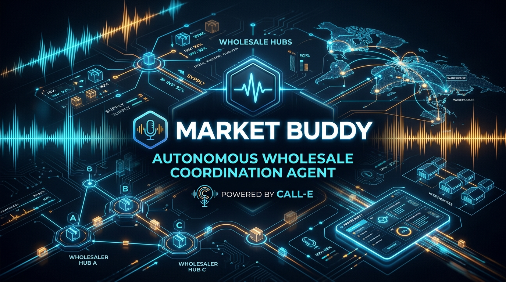
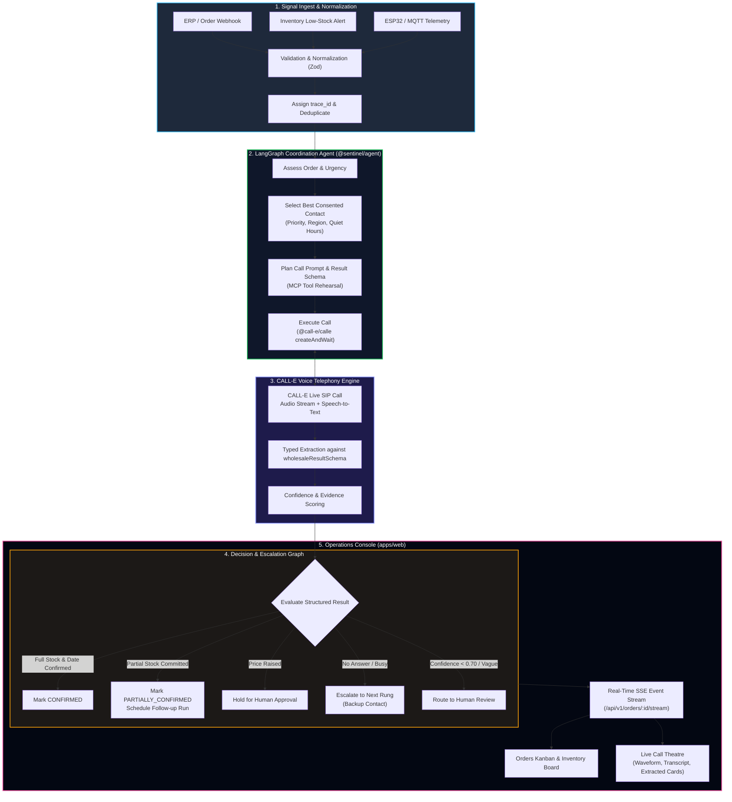
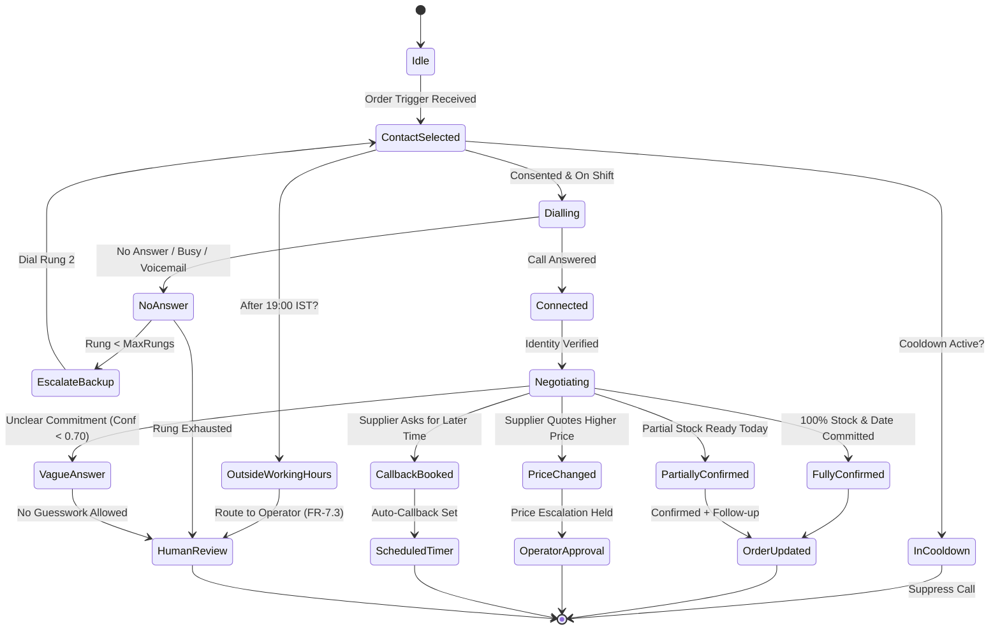
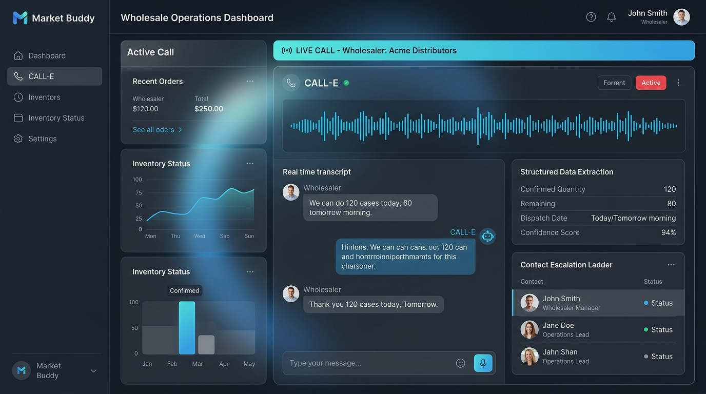

<div align="center">

# 🎙️ Market Buddy

### Autonomous Wholesale Voice Coordination Agent Powered by [CALL-E](https://heycall-e.com)

[](https://heycall-e.com)
[](https://nextjs.org)
[](https://langchain.com)
[](https://www.typescriptlang.org)
[-success?style=for-the-badge&logo=jest&logoColor=white)](#automated-test-suite)
[](#)

<br/>



> *"An inventory database record is just numbers on a screen. A phone conversation with the warehouse supervisor is a commercial commitment."*
>
> **Market Buddy** connects distributors and wholesalers by autonomously calling suppliers, negotiating stock availability, pricing, and dispatch windows, and turning real-time voice conversations into structured, closed-loop order commitments.

</div>

---

## 📑 Table of Contents

- [The Core Problem](#-the-core-problem)
- [The Hero Scenario](#-the-hero-scenario)
- [Architecture & System Design](#-architecture--system-design)
- [Decision & Negotiation State Machine](#-decision--negotiation-state-machine)
- [Live Call Theatre & Dashboard](#-live-call-theatre--dashboard)
- [Failure Handling Matrix (F1–F14)](#-failure-handling-matrix-f1f14)
- [Repository Structure](#-repository-structure)
- [Getting Started](#-getting-started)
- [Real CALL-E Integration](#-real-call-e-integration)
- [Safety & Compliance Guardrails](#-safety--compliance-guardrails)
- [Team & Hackathon Submission](#-team--hackathon-submission)

---

## ⚡ The Core Problem

Wholesale and distribution supply chains move billions of dollars daily on telephone conversations. When an urgent hospital order or retail stockout arrives:
- **ERP records lag**: A database says 200 units exist, but 100 are already allocated or damaged.
- **Emails and tickets get buried**: A supplier might read an email in 6 hours; the truck leaves in 45 minutes.
- **Manual dispatch calling is slow**: Operations coordinators spend 3 to 4 hours every morning dialling suppliers, chasing dispatch slips, and scribbling notes on paper.

**Market Buddy removes the friction.** When an urgent order or inventory signal arrives, Market Buddy identifies the consented supplier contact, dials them through **CALL-E**, negotiates quantity and dispatch timing, extracts typed commitments against a rigorous schema, and writes the verified outcome straight into your order system.

---

## 🎯 The Hero Scenario

```text
Urgent Order Received: 200 cases Temperature-Sensitive Medical Supplies (MED-TS-CASE)
                             │
                             ▼
              [ Market Buddy selects Dispatch Lead ]
             (Rajesh Iyer · Consented · Working Hours)
                             │
                             ▼
                 [ CALL-E places voice call ]
   "Hello, this is Market Buddy automated operations for Northgate..."
                             │
                             ▼
                 [ Voice Negotiation Occurs ]
   Wholesaler: "We don't have 200 ready right now. I can give you
                120 today at 2 PM, and the other 80 tomorrow at 9 AM."
                             │
                             ▼
         [ Structured Schema Extraction & Validation ]
   ✓ Confirmed Quantity : 120 cases (Today, 14:00 IST)
   ✓ Remaining Quantity : 80 cases (Tomorrow, 09:00 IST)
   ✓ Confidence Score   : 0.94 (Above 0.70 floor)
   ✓ Next Action        : FOLLOWUP_SCHEDULED
                             │
                             ▼
            [ Automated Closed-Loop Order Update ]
   - Order CR-1006 status: PARTIALLY_CONFIRMED
   - Automated callback booked for tomorrow at 09:00 IST
   - Operator time saved: 14 minutes
```

---

## 🏗️ Architecture & System Design

Market Buddy operates as an event-driven monorepo orchestrating signal ingest, agent state graphs, voice telephony, and real-time frontend streaming:



---

## 🔄 Decision & Negotiation State Machine

Every phone interaction is governed by strict, deterministic boundaries. The agent can negotiate logistics, but cannot guess, exceed commercial bounds, or approve altered prices autonomously:



---

## 🖥️ Live Call Theatre & Dashboard

Market Buddy features a Next.js 16 (Turbopack) operations console built with Tailwind CSS, Framer Motion, and SSE streaming:



### Key Dashboard Modules
1. **Wholesaler Console (`/ops`)**: Live connected vendor network, call progress counters, and real-time order commitment cards.
2. **Interactive Simulator (`/ops/simulator`)**: Interactively trigger test orders across 6 built-in supplier scenarios (Partial Stock, No-Answer Escalation, Price Changes, Callbacks, Low Confidence, and Duplicate Suppression).
3. **Live Call Theatre (`/ops/orders/[id]`)**:
   - Dynamic real-time audio waveform visualizer.
   - Dual-channel conversational transcript.
   - Extracted typed data fields (confirmed quantity, remaining quantity, dispatch date, confidence score).
   - Audit trail and raw evidence quotes.
4. **Emergency Admin Console (`/ops/admin`)**: One-click kill switch, quiet hour overrides, and cooldown threshold management.

---

## 🛡️ Failure Handling Matrix (F1–F14)

Market Buddy handles 14 real-world telephone failure modes gracefully:

| Code | Failure Mode | Agent Action | Guardrail / Fallback |
|---|---|---|---|
| **F1** | **No Answer / Ringout** | Retry once after 5m; if still no answer, escalate to Rung 2. | Max 2 dials per contact. |
| **F2** | **Busy / Line Dropped** | Wait 3 minutes, re-verify line status, retry. | Max 1 reconnect attempt. |
| **F3** | **Voicemail Detected** | Leaves standardized reference message; does not wait. | Schedules automatic callback window. |
| **F4** | **Partial Stock** | Secures immediate quantity; dates remainder; schedules follow-up. | Core hero flow; updates order balance. |
| **F5** | **Price Discrepancy** | Records quoted unit price; refuses autonomous acceptance. | Routes to operator for price approval. |
| **F6** | **Callback Requested** | Records requested callback time & preferred number. | Registers follow-up task with timer. |
| **F7** | **Wrong Person Answers** | Asks for intended contact; terminates if unavailable. | Never discloses order details to unverified party. |
| **F8** | **Refusal to Supply** | Records refusal reason; moves to backup distributor immediately. | Escalates immediately to next rung. |
| **F9** | **Ambiguous / Vague** | Asks clarifying question once; if still vague, confidence drops. | Confidence < 0.70 routes to human review. |
| **F10** | **Duplicate Request** | Detects matching open order & SKU; suppresses outbound call. | Zero redundant calls placed. |
| **F11** | **Quiet Hours (After 19:00)** | Checks contact timezone; suppresses call unless CRITICAL. | FR-7.3 working hours protection. |
| **F12** | **Contact in Cooldown** | Prevents calling same person within 15 minutes. | Contact cooldown suppression. |
| **F13** | **Ladder Exhausted** | Primary, backup, and supervisor all exhausted. | Flags urgent dispatch alert on dashboard. |
| **F14** | **API / Network Outage** | Exponential backoff; falls back to emergency queue. | Global killswitch & error boundary. |

---

## 📂 Repository Structure

```text
├── apps/
│   └── web/                         # Next.js 16 operations dashboard
│       ├── src/app/                 # App Router (ops, simulator, admin, api)
│       ├── src/components/          # UI components, Call Theatre, CommandBar
│       └── src/lib/                 # SSE client, contracts, mock store, auth
├── packages/
│   ├── agent/                       # LangGraph coordination workflow
│   │   ├── nodes/                   # assessOrder, selectContact, planCall, decide
│   │   ├── coordinationGraph.ts     # State graph definition & edge routing
│   │   └── __tests__/               # Jest integration and unit test suites
│   ├── calle/                       # CALL-E SDK client & prompt engine
│   │   ├── client.ts                # createAndWait() SDK wrapper
│   │   ├── prompt.ts                # Dynamic task prompt generation
│   │   ├── schema.ts                # Structured wholesaleResultSchema
│   │   └── wholesaleMock.ts         # High-fidelity development mock driver
│   └── types/                       # Shared TypeScript domain contracts
├── docs/
│   ├── assets/                      # High-resolution architectural graphics
│   ├── PRD_CALL_E_HACKATHON.md      # Product requirements & specifications
│   ├── FRONTEND_BACKEND_CONTRACT.md # SSE, REST, and event schemas
│   └── CALLE_TESTING_LOG.md         # CALL-E testing and live call budget log
└── skills/                          # Reusable autonomous escalation skill
```

---

## 🚀 Getting Started

### Prerequisites
- **Node.js**: v20.x or later
- **pnpm**: v10.x or later
- **CALL-E Account**: API key from [heycall-e.com](https://heycall-e.com)

### Installation

```bash
# Clone the repository
git clone https://github.com/tanmayai23/CALL-E-Hackathon.git
cd CALL-E-Hackathon

# Install all monorepo dependencies
pnpm install
```

### Configuration

Create a `.env` file in the root directory:

```env
# CALL-E API Credentials
CALLE_API_KEY=your_call_e_api_key_here
CALLE_BASE_URL=https://api.heycall-e.com

# Driver Mode (Keep 'true' for free offline testing)
CALLE_USE_MOCK=true

# Consented E.164 phone number for authorized live calls
CALLE_TEST_PHONE=+91XXXXXXXXXX
```

### Running Locally

```bash
# Start the Next.js development server
pnpm --dir apps/web dev
```

Open [http://localhost:3000](http://localhost:3000) to access the landing page, or [http://localhost:3000/ops](http://localhost:3000/ops) for the operations console.

---

## 🧪 Automated Test Suite

Market Buddy includes a 100% passing test suite with defensive unit and end-to-end integration tests:

```bash
# Run all 19 test suites across the monorepo
pnpm test

# Build all TypeScript packages
pnpm build

# Production build of the web dashboard
pnpm --dir apps/web build
```

```text
Test Suites: 19 passed, 19 total
Tests:       421 passed, 421 total
Snapshots:   0 total
Time:        14.425 s
Ran all test suites.
```

---

## 📞 Real CALL-E Integration

Market Buddy executes live phone calls using the official `@call-e/calle` SDK:

```typescript
import { CalleClient } from "@call-e/calle";
import { wholesaleResultSchema } from "@sentinel/calle/schema";

const calle = new CalleClient({ apiKey: process.env.CALLE_API_KEY });

// Place real phone call and wait for structured extraction
const call = await calle.calls.createAndWait({
  to: contact.phoneE164,
  task: generatedTaskPrompt,
  resultSchema: wholesaleResultSchema,
  maxDurationSeconds: 180,
});

// Access verified, typed outcomes
const { confirmed_quantity, remaining_quantity, dispatch_date, next_action } = call.structuredResult;
const confidence = call.completionConfidence;
```

---

## 🔒 Safety & Compliance Guardrails

Market Buddy follows strict ethical and operational safety rules:
1. **Consented Contacts Only**: Calls are restricted exclusively to pre-registered business telephone numbers with explicit recorded consent.
2. **Automated Disclosure**: Every call begins with explicit identification: *"Hello, this is the Market Buddy automated operations desk calling on behalf of..."*
3. **No Autonomous Price Acceptance**: The agent cannot commit to price hikes, credit terms, or legal changes; all commercial exceptions route to a human operator.
4. **Working Hours Enforcement**: Respects local supplier working hours (09:00–19:00 IST). Non-critical calls after hours are held automatically.
5. **Global Kill Switch**: An instantaneous software kill switch halts all active calls and blocks outbound queuing across the platform.

---

## 👥 Team

| Member | Focus Area |
|---|---|
| **Tanmay** | Lead Architecture, AI Decisioning, CALL-E Integration, Safety & Submission |
| **Aryan** | LangGraph Coordination Workflow, Prompts, Schema & Escalation Graphs |
| **Sameer** | Backend Architecture, Persistence, SSE Streaming, Queue Reliability |
| **Vishal** | Operations Console, Simulator, Telemetry & IoT Integration |
| **Soham** | UI/UX Design System, Live Call Theatre & Visuals |

---

<div align="center">
  <sub>Built with ❤️ for the <strong>CALL-E: Your Code Is Calling Hackathon (2026)</strong></sub>
</div>
